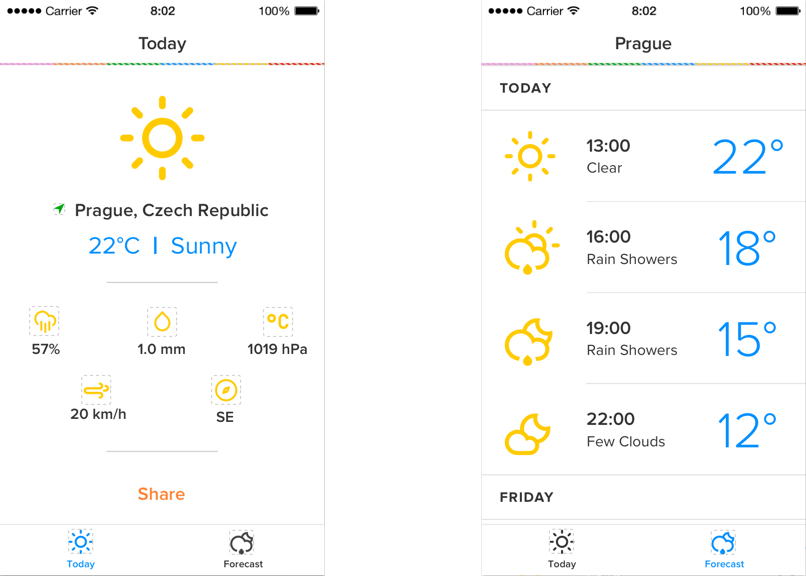

# STRV Test Project

iOS coding challenge proposed by the STRV team

### Instructions

Create a simple iOS app for weather forecasting. It should show the actual weather for your current location. In the forecast tab, show the forecast for the next 5 days (in 3 hour intervals) at your current location.

The app should support the current iOS version and at least 1 lower version. The project must be developed using the latest Swift version in the most recent Xcode production version.

Make sure you consider and handle all possible states of the app (offline, data not loading, errors, etc).

Prepare the app as 
if you are going to give it to the QA team before release to the App Store.
Use:
* Auto Layout and make the layout responsive for all screen sizes your app supports. We
require at least full iPhone support.
* CocoaPods and Swift (do not use Objective-C anymore).
* Open Weather Map API (​http://openweathermap.org/api​).
* Geolocation for determining the current position of the device.
* UIActivityViewController

* Firebase SDK (​https://www.firebase.com/​). Use Firebase for storing of current location and temperaturewhenthisisavailable(Fornow,thinkonlyofstoringthedata).Keepin mind that the app must support multiple users at the same time and the stored data must contain enough information for later processing.

### Extra features
* Auto reconnect
* API provided error messages

### Features that could be implemented
* i18n
* Choosing units between metric and imperial
